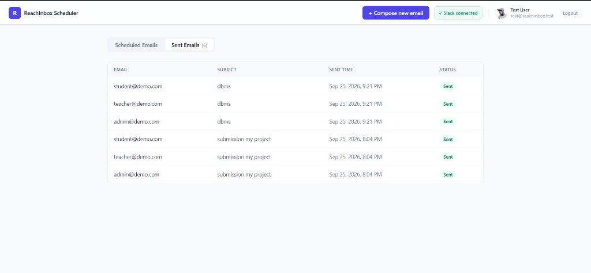
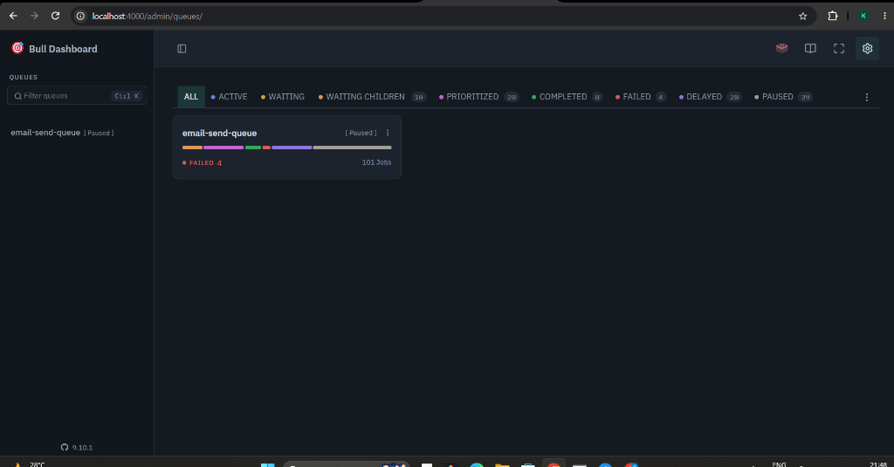

# ReachInbox — Full-stack Email Job Scheduler

A production-shaped slice of ReachInbox's send pipeline: schedule cold
emails via API, fan them out through BullMQ delayed jobs (no cron), throttle
and rate-limit them like a real provider, survive restarts without losing or
duplicating a send, and watch it all from a dashboard.

```text
reachinbox-scheduler/
├── backend/     Express + TypeScript API, BullMQ worker, Postgres, Redis
├── frontend/    Next.js + Tailwind dashboard
└── docker-compose.yml
```

---

## 📸 Project Screenshots

*(Add your screenshots here by replacing these placeholder links!)*

| User Dashboard | Admin BullMQ Dashboard |
| :---: | :---: |
|  <br/> *Standard users can schedule and monitor their own campaigns.* |  <br/> *Admins get live visibility into background workers and queues.* |

---

## 👥 Roles & Access Control

The platform implements Role-Based Access Control (RBAC) to separate standard scheduling tasks from system administration.

### 1. Standard User
- **Access Level:** Private / Isolated
- **Capabilities:**
  - Can only view and manage their *own* scheduled emails and campaigns.
  - Can connect their own Slack account for personalized rate-limit notifications.
  - Can upload leads and dispatch email jobs securely.

### 2. System Admin (`admin@reachinbox.test`)
- **Access Level:** Global
- **Capabilities:**
  - **Global Visibility:** Bypasses standard isolation to view *all* scheduled and sent emails across the entire platform.
  - **BullMQ Admin Panel:** Gets exclusive access to the `System Admin Panel` button in the header, which routes to a live BullMQ instance (`/admin/queues`).
  - **Queue Control:** Can actively monitor, pause, resume, and retry failed background jobs for all users in real-time.

---

## 🚀 Features

**Frontend**
- **Real-Time UI:** Live toast notifications and 5s polling for up-to-the-second email statuses.
- **Role-Based UI:** Conditional rendering of Admin controls based on the active user session.
- **Google OAuth Login:** Seamless authentication redirecting directly to the dashboard.
- **Advanced Compose Modal:** Subject, body, sender configuration, CSV/txt lead upload with detected-address count, start time, delay injection, and hourly limit configurations.
- **Slack Integration:** 1-click connect/disconnect directly from the dashboard header.

**Backend**
- **BullMQ Delayed Jobs:** Zero cron dependencies. Complete reliance on Redis-backed sorted sets for sub-second precision scheduling.
- **Postgres as Source of Truth:** Manages `users`, `campaigns`, `email_jobs`, and `slack_integrations`.
- **Ethereal SMTP Integration:** Auto-provisioned test account via nodemailer for immediate testing out of the box.
- **Live BullMQ Dashboard (`/admin/queues`):** Third-party UI integrated with custom "Back to App" and "Logout" navigation links.
- **Restart-Safe Persistence:** Automated reconciliation pass on boot ensures no jobs are lost or duplicated during server crashes.
- **Configurable Rate Limiting:** Global + per-sender hourly rate limits using Redis atomic Lua scripts (multi-worker safe).
- **Smart Requeuing:** Rate-limited jobs are elegantly pushed into the next hour window (never dropped).
- **Live Slack Notifications:** Real OAuth flow and live webhook notifications fired the exact millisecond a rate-limit is hit.
- **Elasticsearch:** Indexing + search with graceful fallback to Postgres `ILIKE` if ES is unavailable.

---

## 1. Quick start

### Option A — Docker (recommended)

```bash
cp backend/.env.example backend/.env   # fill in Google/Slack creds (optional, see §4)
docker compose up --build
```

This brings up Postgres, Redis, Elasticsearch, and the backend. Then run the
migration once and start the frontend separately:

```bash
docker compose exec backend npm run migrate
cd frontend
cp .env.local.example .env.local
npm install
npm run dev
```

Visit `http://localhost:3000`.

### Option B — Run everything locally

```bash
# Infra only, via Docker
docker compose up postgres redis elasticsearch

# Backend
cd backend
cp .env.example .env
npm install
npm run migrate
npm run dev          # http://localhost:4000

# Frontend (new terminal)
cd frontend
cp .env.local.example .env.local
npm install
npm run dev           # http://localhost:3000
```

The backend needs nothing pre-installed to send mail — if `ETHEREAL_USER` /
`ETHEREAL_PASS` are left blank in `.env`, it auto-provisions a throwaway
Ethereal inbox on boot and logs the credentials + a preview URl is logged
per send in the server console.

---

## 2. Architecture overview

### How scheduling works
- A schedule request (`POST /api/emails/schedule`) creates one `campaigns`
  row and one `email_jobs` row per recipient in Postgres (source of truth),
  then calls `enqueueEmailSend()` for each row.
- `enqueueEmailSend` adds a **BullMQ delayed job** (`queues/emailQueue.ts`)
  with `delay = scheduledAt - now`. Each recipient's `scheduledAt` is
  `startTime + index * delayMs`, so the configured inter-email delay is
  baked into the schedule itself, not just enforced at send time.
- **No cron anywhere.** BullMQ's delayed job set (a Redis sorted set) is the
  only scheduling primitive; a `Worker` (`queues/emailWorker.ts`) picks jobs
  up as their delay elapses.
- A live queue view is exposed via `@bull-board` at
  `http://localhost:4000/admin/queues`.

### How persistence on restart is handled
Two layers:
1. **Primary:** BullMQ stores every job (waiting, delayed, active) in Redis
   itself, independent of the Node process. A plain `npm run dev` restart
   (Redis untouched) resumes exactly where it left off — nothing to do.
2. **Reconciliation (`bootstrap/recoverJobs.ts`, runs on every boot):**
   covers the harder case where Redis itself lost its data (e.g. a fresh
   container with no volume). It queries Postgres for any `email_jobs` row
   still `scheduled` / `processing` / `requeued` with no matching job in
   BullMQ, and re-enqueues it.

**Idempotency:** every BullMQ job's `jobId` is set to the `email_jobs.id`
UUID. BullMQ de-dupes `add()` calls on `jobId` — calling it again for a job
already waiting/delayed/active is a no-op that returns the existing job. So
whether recovery runs once or five times, the same email is never
double-queued or double-sent. The worker also re-checks the DB status
before sending and skips anything already marked `sent`.

### How rate limiting & concurrency are implemented
- **Concurrency:** `Worker` is created with `concurrency: WORKER_CONCURRENCY`
  (env-configurable), so N jobs can be *picked up* in parallel.
- **Minimum delay between sends:** the worker also sets BullMQ's `limiter:
  { max: 1, duration: MIN_DELAY_BETWEEN_EMAILS_MS }`, which throttles how
  often the worker pool as a whole is allowed to pull a new job regardless
  of concurrency — a simple, effective stand-in for "provider throttling."
  Documented trade-off: this throttles per-worker-process throughput, not
  strictly per-sender; for true per-sender pacing at higher scale you'd
  shard senders across separate queues/workers.
- **Hourly limits (global + per-sender):** enforced with a Redis Lua script
  (`services/rateLimiter.ts`) that atomically checks-and-increments two
  counters — `ratelimit:global:{hourWindow}` and
  `ratelimit:sender:{email}:{hourWindow}` — keyed by the current hour
  bucket. Because it's a single `EVAL`, it's safe under concurrent workers
  or multiple app instances (no read-then-write race). Limits are fully
  configurable via `MAX_EMAILS_PER_HOUR` and
  `MAX_EMAILS_PER_HOUR_PER_SENDER`, or overridden per campaign from the
  compose form.
- **On limit hit:** the job is **not** dropped or failed. The worker calls
  `job.moveToDelayed(nextHourWindowStart, token)` (BullMQ's `DelayedError`
  pattern) to push the *same* job into the next hour window, preserving
  its position relative to other requeued jobs, and flips its DB status to
  `requeued` (visible in the "Scheduled" tab). A live Slack message is sent
  the moment this happens (see below).
- **Under load (1000+ emails at once):** they all land as delayed jobs at
  roughly the same timestamp; the worker's concurrency + limiter throttle
  how fast they're actually dequeued, and the hourly counters push any
  overflow into subsequent hour windows automatically — no special-casing
  needed, the same logic handles 10 emails or 10,000.

### Slack notifications
Real OAuth flow: "Connect Slack" → `/api/slack/oauth/authorize` (requires
login) → Slack's authorize screen (`incoming-webhook` scope) →
`/api/slack/oauth/callback` exchanges the code via `oauth.v2.access` and
stores the resulting webhook URL per user. The worker posts directly to
that webhook the moment a rate limit is hit. If the user never connected
Slack, `notifySlackRateLimitHit` no-ops silently (checked fresh from the DB
on every hit, so connecting later "just works" without a redeploy).

### Search
`GET /api/emails/search?q=...` indexes sent/scheduled emails into
Elasticsearch (`services/elasticsearchClient.ts`) when `ELASTICSEARCH_URL`
is set, and falls back to a Postgres `ILIKE` query otherwise so the feature
still works end-to-end without standing up ES.

---

## 4. Environment variables

See `backend/.env.example` and `frontend/.env.local.example` for the full,
commented list. Notably:

- `GOOGLE_CLIENT_ID` / `GOOGLE_CLIENT_SECRET` — create at
  console.cloud.google.com (OAuth consent screen + Web application
  credentials, authorized redirect URI
  `http://localhost:4000/api/auth/google/callback`). Without these, the
  login button returns a clear 501 instead of failing silently.
- `SLACK_CLIENT_ID` / `SLACK_CLIENT_SECRET` — create a Slack app at
  api.slack.com/apps with the `incoming-webhook` OAuth scope and redirect
  URI `http://localhost:4000/api/slack/oauth/callback`.
- `ETHEREAL_USER` / `ETHEREAL_PASS` — optional; leave blank for
  auto-provisioning.
- `ELASTICSEARCH_URL` — optional; omit to use the Postgres fallback.

---

## 5. Assumptions, shortcuts & trade-offs

- Auth uses a signed JWT in an httpOnly cookie rather than server-side
  sessions — simpler to run without a session store, same security
  properties for this scope.
- CSV/lead parsing happens client-side (regex-extract email addresses from
  the uploaded file) rather than a separate upload endpoint, since the spec
  only requires showing the detected count before scheduling.
- The minimum-delay throttle is enforced at the worker-pool level (BullMQ
  `limiter`) rather than a strictly per-sender token bucket; called out
  above as a documented trade-off.
- Dashboard status updates via 5s polling rather than websockets/SSE —
  simplest thing that satisfies "view scheduled/sent emails" without extra
  infra.
- `campaigns`/`email_jobs` don't implement multi-tenant sender rotation
  beyond "one sender email per campaign"; the per-sender rate limiter is
  still fully general (keyed by sender email) for when that's added.
